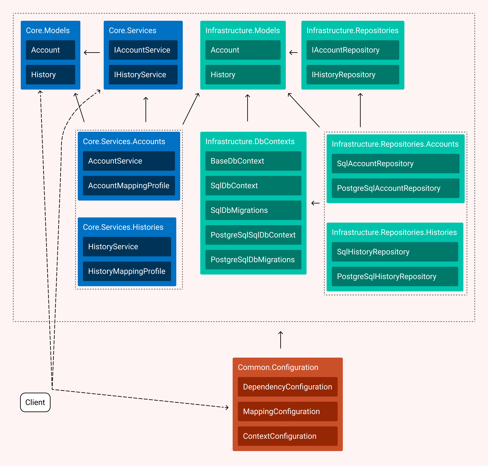

# Readme

How to setup for Asp.Net Core:

```csharp
public void ConfigureServices(IServiceCollection services)
{
    services.AddMvc();
    
    // other code
    
    SharedLoginConfiguration.Configure(services, Configuration, Configuration.GetConnectionString("MyDbConnection"));    
}
```


